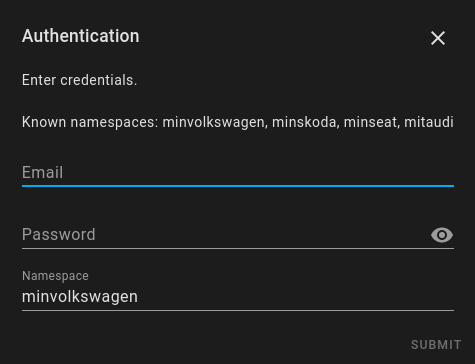
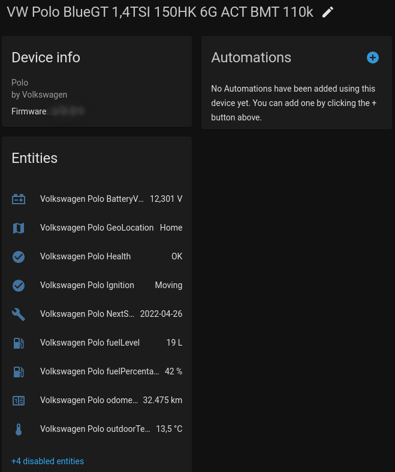
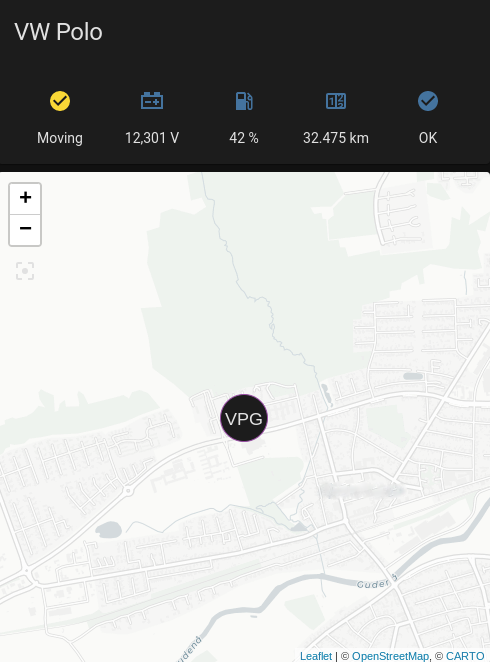

# Connectedcars.io (Min Volkswagen)

[](https://github.com/custom-components/hacs)

The `Connectedcars.io (Min Volkswagen)` component is a Home Assistant custom component for showing car information for Danish Volkswagens equipped with the hardware to send data to the mobile app "Min Volkswagen". 
Min Skoda, Min Seat and Mit Audi all use the same backend and should work as well, although still not tested.

## Installation
---
### Manual Installation
  1. Copy  `connectedcars_io`  folder into your custom_components folder in your hass configuration directory.
  2. Restart Home Assistant.

### Installation with HACS (Home Assistant Community Store)
  1. Ensure that [HACS](https://hacs.xyz/) is installed.
  2. Search for and install the `Connectedcars.io (Min Volkswagen)` integration.
  3. Restart Home Assistant.


## Configuration

It is configurable through config flow, meaning it will popup a dialog after adding the integration.
  1. Head to Configuration --> Integrations
  2. Add new and search for `Connectedcars.io (Min Volkswagen)` 
  3. Enter credentials and namespace.

#### Currently known namespaces
 - minvolkswagen *(default)*
 - minskoda
 - minseat
 - mitaudi

#### Multiple cars
If you have multiple cars on the same account, they should all appear.  
If you have multiple cars of different brands, add the integration multiple times each with the suitable namespace.  
*So far only tested with a single car*

## State and attributes
A device is created for each car.
For each car the following sensors can be created, but only when data is present. Thus fuel based cars should have fuel level sensors, while EVs should have battery sensors. 

The naming scheme is `{brand} {model} <name>`.  
Sensor names:
* BatteryVoltage (12V battery)
* EVHVBattTemp (EV, untested)
* EVchargePercentage (EV, untested)
* fuelLevel
* fuelPercentage
* GeoLocation
* Health
* Ignition
* Lamp *+name* (one sensor per each reported lamp, disabled by default)
* NextServicePredicted (disabled by default)
* odometer
* outdoorTemperature


## Debugging
It is possible to debug log the raw response from the API. This is done by setting up logging like below in configuration.yaml in Home Assistant. It is also possible to set the log level through a service call in UI.  

```
logger: 
  default: info
  logs: 
    custom_components.connectedcars_io: debug
```

## Examples

Configuration  


Device  


Dashboard  


Location state  


